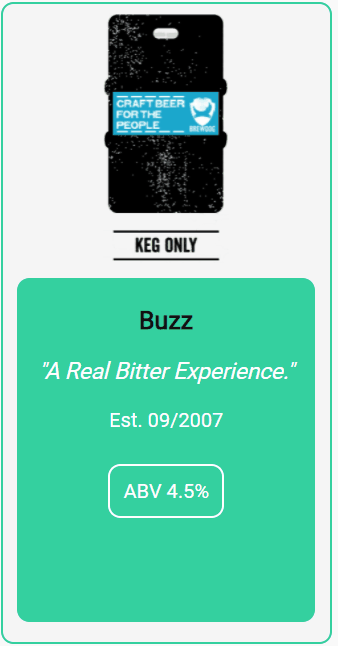

<h1> REACTJS: PUNK API Beer Database</h1>

<h2>Skills</h2>

<ul>
<li>ReactJS</li>
<li>JavaScript in ReactJS</li>
<li>Semantic HTML in ReactJS</li>
<li>CSS</li>
<li>SASS</li>
<li>BEM</li>
<li>API</li>
<li>Git & GitHub</li>
<li>Responsive Design</li>
<li>Enzyme Testing</li>
</ul>

<h2>Key features</h2>

<ul>
<li>Cards displaying beer data from PUNK API</li>
<li>Front & back Card display</li>
<li>Search Function via text input</li>
<li>Radio buttons for filtering</li>
</ul>

<h2>Logic & Method: The Punk API beer database with search and filter</h2>

The brief was to create a beer database using the PUNK API.

This was my first attempt at a full ReactJS project.

I initially created all my components and relevant files. I then used a Fetch method to request the data from the PUNK API.
This data is then displayed in the CardFront and CardBack components using props.
I styled the cards so that they flip to show either the front and back, to create a single card component.
I also included a scroll bar to display the beer description as in some instances it displayed a large amount of text.



I then created a presentational CardList component to display the cards in a grid.


Once the beer cards were displayed in a grid for responsiveness I created a SideNav component with a search bar and radtio filter buttons.

I created the search bar, so that when the user types text into the text input it updates state (setBeers) using an OnInput event listener. I added toLowerCase() to the value OnInput to ensure all values were changed to lower case and there were no issues with matching case between the users value and the data in the API.

I then created a function in App.JSX that matches the new state to the data in the fetch, his is done via props.

I similarly set state as false for the radio buttons and OnClick these change to true.
I then created functions in App.JSX that call data from the relevant fetch (there are 3 criteria) if the button is true.

Foe example, I used the PUNK API docs to show all beers that have an ABV > 6 by using the URL parameters.

```
export const abvFetch = () => {
return fetch("https://api.punkapi.com/v2/beers?abv_gt=6")
.then((res) => res.json())
.then((jsonResponse) => {
return jsonResponse;
});
};
```

Using props, I created a function called getContentJSX which displays cards in accordance with the users activity displaying the relevant data. If the userBeerSearch state is updated, then it will show beers matching to the users input.
Using useEffect() if the state is updated for abvCheck, classicCheck and acidicCheck and the radio button is true, it will then display beers in accordance with the relevant fetch parameters.


For simplicity I styled the project with 3 colours and used the Google Font ROBOTO. I added hover to the buttons and text areas on the cards.

As well a pulse animation to the cards for added UX.

Lasly, a restart button reloads the page to reset the filters and search.

I hope you enjoy my PUNK API beer database!
